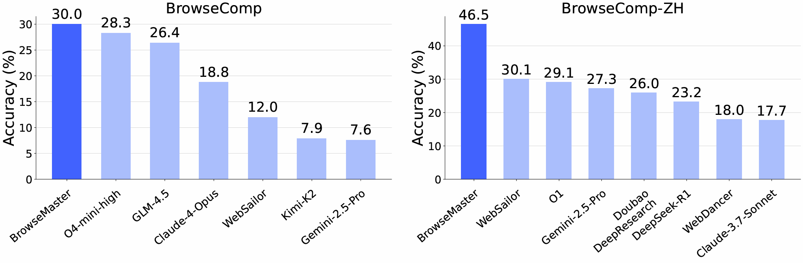
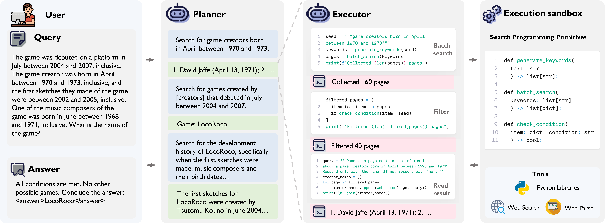
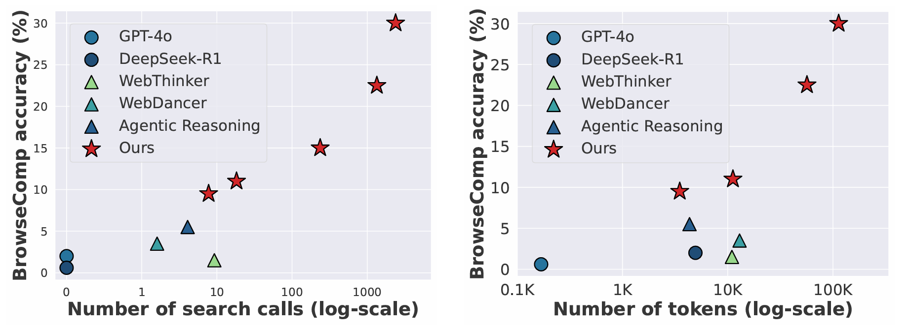
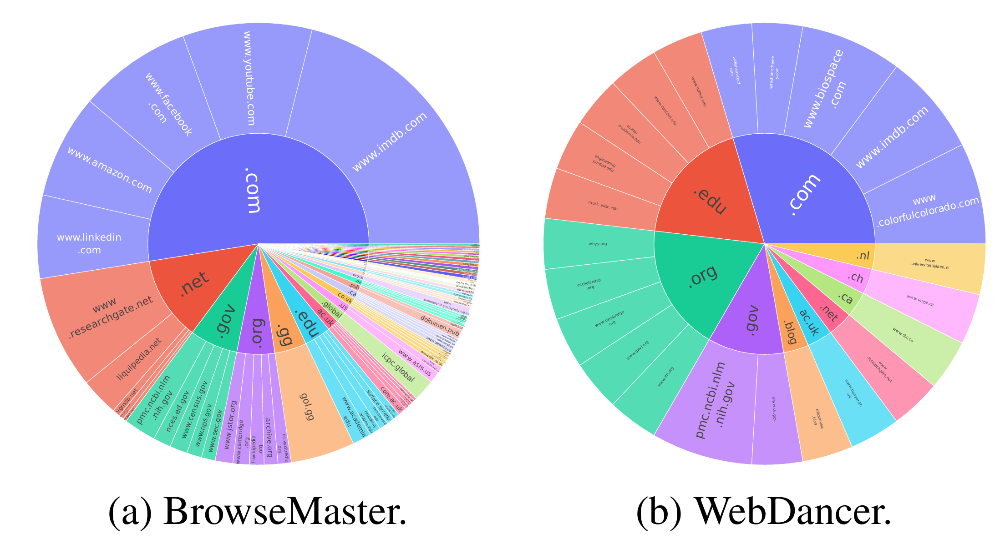

# 🚀 BrowseMaster: Scalable Web Browsing via Tool-Augmented Programmatic Agent Pair

**BrowseMaster** is a next-generation LLM-based web browsing agent that addresses the shortcomings of traditional search and existing agents by uniting **broad, code-driven search** with **deep, strategic reasoning**.  
Its **Planner–Executor** framework delivers scalable, coherent, and efficient information seeking, achieving strong results on both BrowseComp and BrowseComp-ZH benchmarks.

---

## 🛠️ Framework

---

## 🔑 Key Features

- 🧠 **Planner–Executor Framework** – Separates large-scale, code-driven search from high-level reasoning for cleaner context and deeper thinking.  
- 📜 **Code-Based Search Primitives** – Execute `batch_search`, `check_condition`, `generate_keywords` operations over thousands of pages with minimal context overhead.  
- 🎯 **Confidence-Guided Replanning** – Dynamically reset strategy when confidence is low to avoid premature convergence.  

---

## 📊 Experiments

### 🚀 Scaling Search Calls & Computation Efficiency

### 🌐 Breadth of Domains Explored

